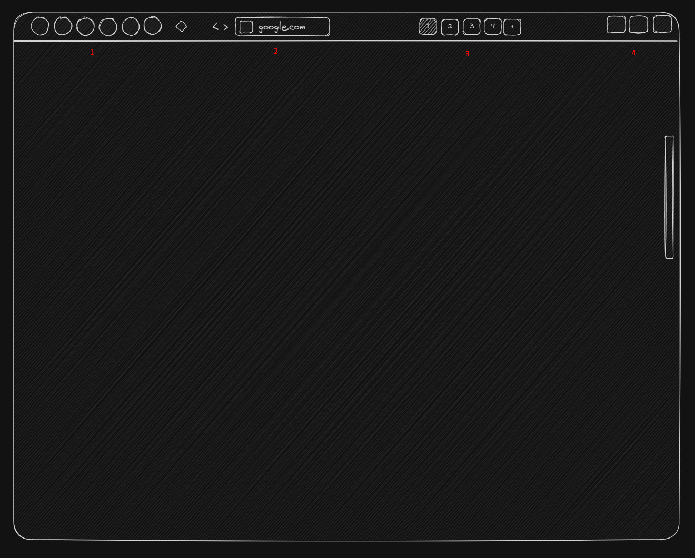

# Initial design thoughts

- tried Arc layout, but sidebar didn't fit to me
- i decided to hide everything except most essential indicators:
  1. extensions
  2. address bar
  3. current workspaces/spaces
  4. window decorations

when you open "workspace" view you can see/control:
1. workspace name
2. current profile:
   - (separates cookies so you can work in 1 profile with personal accounts and in 2 profile with work accounts)
3. active tabs
4. saved tabs (bookmarks)
5. extensions for current space (yup i'm gon try to do it). Why?:
   - Imagine are blocked by roskomnadzor from internet
     - You have vpn, but it doesn't have proper split vpn feature for everything within tab (nordvpn)
     - You create one normal space, and another space with enabled vpn
     - ...
     - Profit!
   - You want to trade crypto, do some memecoin stuff whatever
     - You enable solflare, backpack and metamask on new space called "Cryptotrading"
     - ...
     - Profit!
   - Think about it

